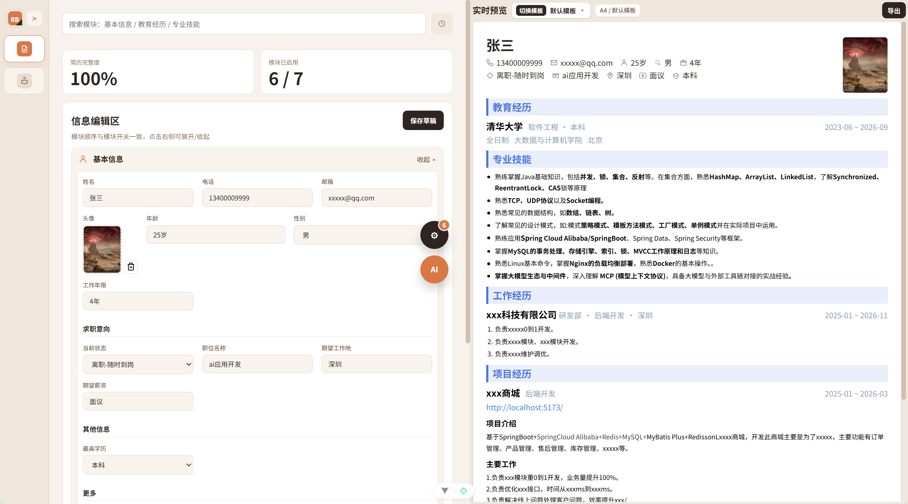

<!-- author: jf -->
# Resume Builder

一个基于 Vue 3 + Vite 的简历编辑与 AI 面试一体化项目，支持 Spring Boot 后端接入、面试会话历史、流式回复和语音输入。

## 功能概览

### 1) 简历编辑
- 模块化编辑：基本信息、教育经历、专业技能、工作经历、项目经历、荣誉奖项、个人简介
- 模块可见性开关与顺序调整（`basicInfo` 固定首位）
- 自动本地保存与手动保存草稿
- 模板切换（当前内置 8 套模板）
- 导出能力：高清 PDF、压缩 PDF、Markdown

### 2) AI 优化（简历模块）
- 通过后端接口进行流式优化（SSE）
- 支持分模块优化并输出“优化建议 + 优化后内容”
- 一键应用优化结果并支持撤销
- 当前可直接应用模块：`skills`、`selfIntro`、`workExperience`、`projectExperience`、`awards`

### 3) AI 面试
- 双模式切换：
  - 候选人模式（AI 扮演面试官）
  - 面试官模式（AI 扮演候选人）
- 面试控制：开始、暂停/继续、结束并评分、重置、时长 `-5m/+5m`
- 倒计时范围：15~120 分钟，超时可自动触发结束评分
- 历史会话列表与会话详情恢复
- 流式回复渲染（NDJSON）
- 语音输入：
  - 优先使用后端实时语音
  - 不可用时自动降级到浏览器语音识别
  - 快捷键 `Ctrl + I` 开关语音
- 已结束会话不可继续/发送消息

## 页面截图





## 技术栈

- 前端：Vue 3、TypeScript、Pinia、Vite
- 富文本/渲染：Markdown-It
- 导出：html2pdf.js
- 代码质量：Oxlint、ESLint、vue-tsc
- 后端：Spring Boot 3、Spring AI、MyBatis-Plus
- 数据库：MySQL（业务/会话）、PostgreSQL + pgvector（向量检索）

## 快速开始

### 方式 A：仅启动前端

```bash
npm install
npm run dev
```

默认地址：`http://localhost:5173`

### 方式 B：前后端联调（推荐）

1. 启动后端依赖数据库（在 `spring-ai-backend/` 下）：

```bash
docker compose up -d
```

2. 启动 Spring Boot 后端（在 `spring-ai-backend/` 下）：

```bash
mvn spring-boot:run
```

默认后端地址：`http://localhost:8999`

3. 启动前端（项目根目录）：

```bash
npm install
npm run dev
```

### 方式 C：仅容器部署前端静态站点

```bash
docker compose up --build -d
```

访问：`http://localhost:3000`

## 环境配置

### 前端

通过 `VITE_AI_BACKEND_URL` 指定 AI 后端地址，默认值为 `http://localhost:8999`。

示例（`.env.local`）：

```bash
VITE_AI_BACKEND_URL=http://localhost:8999
```

### 后端

后端环境变量示例见：

`spring-ai-backend/.env.example`

至少需要配置可用的 OpenAI 兼容服务（如 `OPENAI_API_KEY`，或按 chat/speech/realtime 分别配置）。

## 常用脚本

```bash
# 本地开发
npm run dev

# 构建（含类型检查）
npm run build

# 仅构建前端产物
npm run build-only

# 预览构建结果
npm run preview

# 类型检查
npm run type-check

# 代码检查（自动修复）
npm run lint

# 格式化
npm run format
```

## 目录结构

```text
resume-builder/
  src/
    api/                         # 前端请求封装（chat/interview/speech/realtime）
    components/
      ai/                        # AI 配置、AI 优化、AI 面试界面
      common/                    # 通用组件（侧边栏、富文本等）
      resume/                    # 简历编辑器与预览
    services/
      prompts/                   # AI 提示词模板
      interview/                 # 面试类型定义
      aiOptimizeBackendService.ts
      interviewService.ts
      realtimeSpeechService.ts
    stores/
      resume.ts                  # 简历数据状态
      aiConfig.ts                # AI 配置状态
    templates/resume/            # 简历模板注册与实现
  spring-ai-backend/             # Spring Boot AI 后端
```

## 后端 API（摘要）

基础路径：`/api/ai`

- `POST /chat`：普通问答
- `POST /chat/stream`：流式问答（SSE）
- `POST /audio/transcriptions`：音频转写
- `POST /realtime/client-secret`：实时语音临时密钥
- `POST /interview/turn/stream`：面试流式回合（NDJSON）
- `GET /interview/sessions`：面试会话列表
- `GET /interview/sessions/{sessionId}`：会话详情
- `POST /rag/query`：RAG 检索问答
- `POST /rag/documents`：RAG 文档入库

更多后端细节见 [spring-ai-backend/README.md](spring-ai-backend/README.md)。

## 内置 Codex Skills

项目内置技能目录：`.codex/skills/`

- `resume-template-from-image`
- `resume-backend-project-optimizer`
- `resume-interview-coach`

## License

MIT
